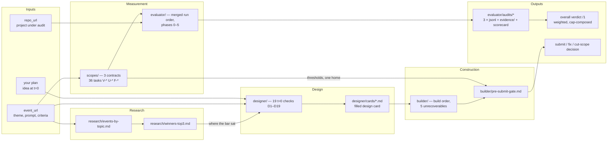
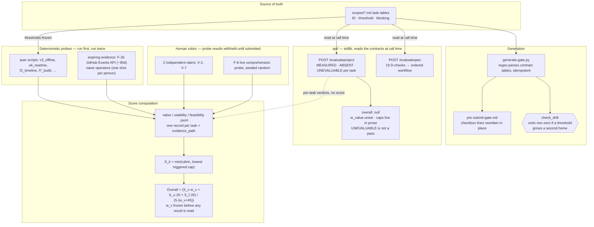

# WinningHackProjects

Research repo on **what actually wins hackathons** across the 7 topics we build in — so our own
project is designed to win rather than designed and then submitted.

## Topics

1. Agent Tool Call · 2. Retrieval · 3. Agent Memory · 4. Evals · 5. Loop Engineering ·
6. Graph Engineering · 7. Harness

## The five layers

The repo answers five questions in order. Each layer feeds the next.

| Layer | Question | Where |
|-------|----------|-------|
| **Research** | Who won, at which events, with what? | [research/](research/) |
| **Measurement** | How good was it *really*, on Value / Usability / Feasibility? | [scopes/](scopes/) + [evaluator/](evaluator/) |
| **Design** | Given a *new* event, what do we build, and will it clear that bar? | [designer/](designer/README.md) |
| **Construction** | How do I build something that passes all three? | [builder/](builder/) |
| **Service** | Answer both, over HTTP | [api/](api/README.md) |

## Layout

| Path | Contents |
|------|----------|
| [research/events-by-topic.md](research/events-by-topic.md) | 16 events mapped to the 7 topics, with relevance verdicts and gallery links. |
| [research/winners-top3.md](research/winners-top3.md) | Top 3 winners for every event, what each built, and a link. |
| [research/winner-audits.md](research/winner-audits.md) | The contracts run against **28 winning repos** across 10 events. **0 of 28 pass all eight measured tasks** — and three faults in the contracts, found by running them. |
| [scopes/](scopes/README.md) | The three audit contracts, verbatim: [value](scopes/value.md), [usability](scopes/usability.md), [feasibility](scopes/feasibility.md). |
| [evaluator/](evaluator/README.md) | Merged run order, caps, and a [scorecard template](evaluator/scorecard-TEMPLATE.md) for auditing any won project. Results land in [evaluator/audits/](evaluator/audits/). Alongside it, a [deep-dive template](evaluator/deep-dive-TEMPLATE.md) — the scorecard measures, the deep-dive explains. |
| [designer/](designer/README.md) | The 19 checks that run at t=0, before any code exists — each buys a specific audit task you would otherwise find out about too late. Plus a [design card](designer/design-card-TEMPLATE.md), filled per idea into [designer/cards/](designer/cards/). |
| [api/](api/README.md) | Two endpoints over the layers: `POST /evaluateproject` audits a repo that exists, `POST /evaluatespec` returns the ordered work to make a plan clear the bar. Stdlib only, thresholds read from the contracts at call time. |
| [builder/](builder/README.md) | The contracts inverted into a build spec, plus the [pre-submit gate](builder/pre-submit-gate.md) — whose checkbox lines are generated from the contracts by [generate-gate.py](builder/generate-gate.py), so a threshold has one home. |
| [requirements.md](requirements.md) | Functional + non-functional requirements, improved by three advisor passes (metric-design, qe-ic, ds-ic) plus an Ousterhout module review; includes the scoring function and the `w_value` tradeoff math. |

## Workflow

1. Pick a topic; read its winners in `research/winners-top3.md`.
2. Audit two or three of them with `evaluator/` — the goal is not to catch them out, but to
   find **where the bar actually sat**. A project that won while failing a scope proves the
   judges didn't test that scope.
3. For a new event, fill a design card from `designer/` **before writing code** — 30 of the 36
   audit tasks are ABSENT at that point, and the 19 that are not buy the ones you cannot fix later.
4. Feed the card into `builder/` when speccing the project.
5. Run `builder/pre-submit-gate.md` before submitting.

## How the output is computed

### Inputs → outputs, across the five layers

### Backend architecture — how a verdict is produced

The scoring math, the `w_value` sensitivity analysis, and the advisor-reviewed requirements
behind both diagrams live in [requirements.md](requirements.md).

## Status

- Event table: 16 rows across 7 topics, all gallery URLs resolved.
- Top-3 winners: pulled for 14 of 16 events. Two have no ranked winners to pull — Enterprise
  MCP (still open voting) and Agentic Orchestration (6 unranked finalists).
- Contracts: **36 tasks, 21 blocking.** `V-10` (the demo artifact judges actually watch) added
  after two external rubrics and one event confirmed the gap; `V-7` promoted to blocking; `V-9`
  demoted to advisory at 6/28 winner pass.
- Design layer: 19 t=0 checks, 16 of them mechanical, covering 30 of 36 audit tasks. The
  remaining 6 are recorded as ABSENT-until-built rather than left out. Cards filled: **none yet**.
- Winner audits: **28 repos across 10 events**, harvested from the galleries' embedded
  `ItemList` — 1,060 of 1,092 projects carry a repo link. **0 of 28 pass all eight measured tasks.**
- API: two endpoints, stdlib only, thresholds read from the contracts at call time.
- Scorecards filled in `evaluator/audits/`: **none yet** — the 28-repo pass above ran the
  computable tasks only, and is recorded in research/, not as scorecards.

## Open questions

**`w_value` is unset.** The source contracts weight Usability 25 and Feasibility 20 but never state
Value's weight. Nothing here invents one — `/evaluateproject` returns `overall: null` and says why.
Set it before running a weighted total, and record it in the scorecard *before* reading any result.

**Nothing here explains why anyone wins.** 28 winners and 0 losers is a set selected on the
outcome. The gallery harvest makes ~1,050 non-winning projects reachable; sampling them is the one
move that would turn these contracts from *does it hold up* into *does it win*.
