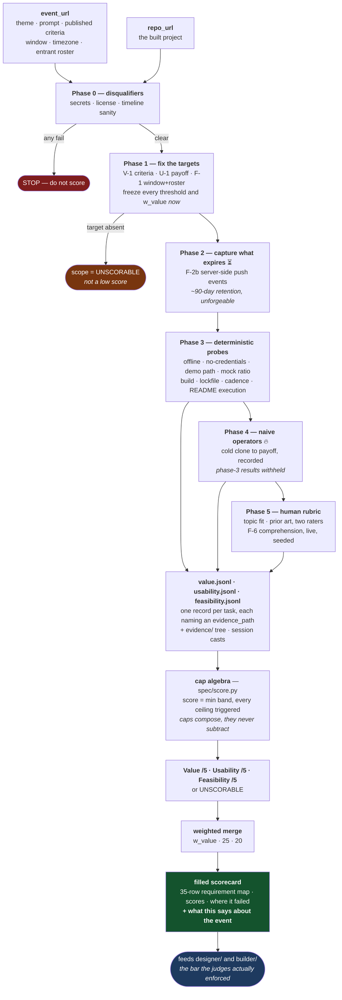
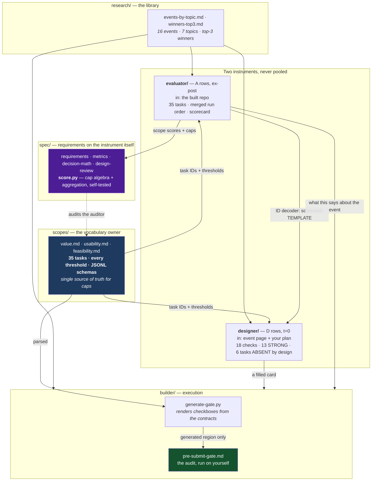

# WinningHackProjects

Research repo on **what actually wins hackathons** across the 7 topics we build in — so our own
project is designed to win rather than designed and then submitted.

## Topics

1. Agent Tool Call · 2. Retrieval · 3. Agent Memory · 4. Evals · 5. Loop Engineering ·
6. Graph Engineering · 7. Harness

## The layers

The repo answers five questions in order. The first four feed each other; the fifth measures
the other four.

| Layer | Question | Where |
|-------|----------|-------|
| **Research** | Who won, at which events, with what? | [research/](research/) |
| **Measurement** | How good was it *really*, on Value / Usability / Feasibility? | [scopes/](scopes/) + [evaluator/](evaluator/) |
| **Design** | Given a *new* event, what do we build, and will it clear that bar? | [designer/](designer/README.md) |
| **Construction** | How do I build something that passes all three? | [builder/](builder/) |
| **Instrument** | Is the measuring device itself sound? | [spec/](spec/README.md) |

## Layout

| Path | Contents |
|------|----------|
| [research/events-by-topic.md](research/events-by-topic.md) | 16 events mapped to the 7 topics, with relevance verdicts and gallery links. |
| [research/winners-top3.md](research/winners-top3.md) | Top 3 winners for every event, what each built, and a link. |
| [scopes/](scopes/README.md) | The three audit contracts, verbatim: [value](scopes/value.md), [usability](scopes/usability.md), [feasibility](scopes/feasibility.md). |
| [evaluator/](evaluator/README.md) | Merged run order, caps, and a [scorecard template](evaluator/scorecard-TEMPLATE.md) for auditing any won project. Results land in [evaluator/audits/](evaluator/audits/). Alongside it, a [deep-dive template](evaluator/deep-dive-TEMPLATE.md) — the scorecard measures, the deep-dive explains. |
| [designer/](designer/README.md) | The 18 checks that run at t=0, before any code exists — each buys a specific audit task you would otherwise find out about too late. Plus a [design card](designer/design-card-TEMPLATE.md), filled per idea into [designer/cards/](designer/cards/). |
| [builder/](builder/README.md) | The contracts inverted into a build spec, plus the [pre-submit gate](builder/pre-submit-gate.md) — whose checkbox lines are generated from the contracts by [generate-gate.py](builder/generate-gate.py). That makes the gate's thresholds derived rather than typed; the [census in spec/](spec/design-review.md) shows the other three consumers are not yet. |
| [spec/](spec/README.md) | Requirements on the instrument itself — 13 functional, 12 non-functional — plus the [metric hardening](spec/metrics.md), the [decision math](spec/decision-math.md), a [module design review](spec/design-review.md), and [score.py](spec/score.py), which makes the aggregation runnable rather than asserted. |

## Architecture

### What goes in, what comes out

Two URLs in, one defensible verdict out. Everything between them is ordered by what *expires* —
the timeline evidence has a 90-day life, and a naive operator has a single-use one.

The two boxes that matter most are the ones marked with a clock and a flame. `F-2b` is the only
unforgeable timeline evidence and it is gone at ~90 days. Naive operators are consumed on first
contact — `n` is spent, not sampled — which is why phase 4 sits after every automated probe and
before any rater opinion exists to leak.

### The backend that computes it

Five layers, one vocabulary. The contracts own every threshold; everything else is meant to be
*rendered* from them rather than typed — see [spec/design-review.md](spec/design-review.md) for
where that is not yet true.

`research/` imports nothing and `designer/` is imported by nothing: the layering runs one way, which
is why a change to a contract can propagate outward without a cycle. The dotted edge is the only one
that runs backwards — `spec/` measures the instrument rather than a project, and its findings land
as edits to the contracts.

**Two properties this diagram is drawn to make visible:**

- **`D` rows and `A` rows never combine into one number.** Their inputs differ — a plan versus a
  built repo — so a design card that reads well is a statement that the unrecoverable things were
  scheduled, never a prediction that an audit will pass.
- **Only one arrow into the gate is generated.** `generate-gate.py` renders the gate's checkbox
  lines from the contracts, and every other restatement of a threshold in this tree is still typed
  by hand. That gap is finding #8 in [spec/](spec/README.md), and it is the root cause of ten of the
  fourteen open design findings.

## Workflow

1. Pick a topic; read its winners in `research/winners-top3.md`.
2. Audit two or three of them with `evaluator/` — the goal is not to catch them out, but to
   find **where the bar actually sat**. A project that won while failing a scope proves the
   judges didn't test that scope.
3. For a new event, fill a design card from `designer/` **before writing code** — 29 of the 35
   audit tasks are ABSENT at that point, and the 18 that are not buy the ones you cannot fix later.
4. Feed the card into `builder/` when speccing the project.
5. Run `builder/pre-submit-gate.md` before submitting.

## Status

- Event table: 16 rows across 7 topics, all gallery URLs resolved.
- Top-3 winners: pulled for 14 of 16 events. Two have no ranked winners to pull — Enterprise
  MCP (still open voting) and Agentic Orchestration (6 unranked finalists).
- Scope contracts: all three captured.
- Design layer: 18 t=0 checks across the three scopes, covering 29 of 35 audit tasks. The
  remaining 6 are recorded as ABSENT-until-built rather than left out. Cards filled: **none yet**.
- Audits run: **none yet** — `evaluator/audits/` is empty.
- Instrument spec: 13 functional and 12 non-functional requirements, each with a metric and an
  instrument. 3 are contradicted by artifacts already committed and are the work queue —
  see [spec/README.md](spec/README.md).
- Design review: 25-row catalog, **14 FAIL · 10 PASS · 1 N/A**. Ten of the fourteen share one root
  cause — a threshold that is typed in up to seven places and generated in one.

## Open question

The source contracts weight Usability 25 and Feasibility 20 but never state Value's weight.
Nothing here invents one. Set `w_value` before running a weighted total, and record it in the
scorecard *before* reading any result.

What [spec/decision-math.md](spec/decision-math.md) adds is that **you usually do not have to
pick.** Two projects swap rank at exactly one weight, `w* = −(25·Δu + 20·Δf) / Δv`; if that falls
outside the admissible `(0, 55]`, the ranking holds for every weight the source permits and the
honest report is that the choice did not change the answer. `spec/score.py` computes it. Pick a
point value only when `w*` says it matters — and note that the merge is currently a weighted
*arithmetic* mean, which partly undoes the caps the rest of the instrument is built on.
